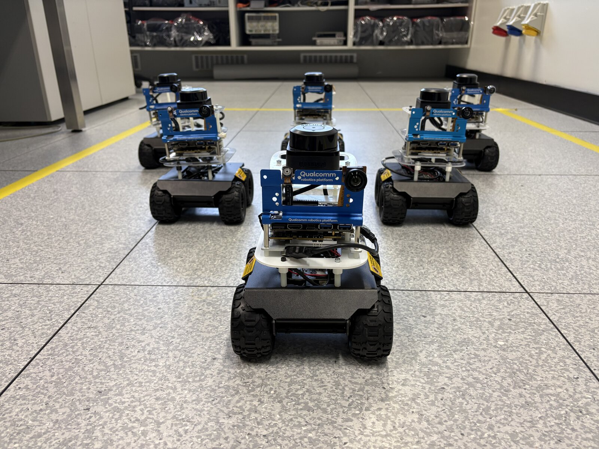

# QB3rt host Nav2

**QB3rt** is a classroom / lab AGV stack for skid-steer WAVE ROVER bases with a
Qualcomm Robotics RB3 Gen 2 onboard. This repository is the **host (laptop)
side**: Nav2 planner/controller/behaviors, velocity smoother, collision
monitor, and RViz. Sensing, localization, and mapping stay on the robot.

> This repository is paired with the robot-side stack:
> [briandeegan82/QB3rt_rb3](https://github.com/briandeegan82/QB3rt_rb3).
> The robot owns sensors, EKF, and slam_toolbox; this repo owns remote Nav2
> and visualization. Bring up the robot from that repo first, then run Nav2
> here.



*QB3rt fleet — WAVE ROVER skid-steer base + Qualcomm RB3 Gen 2 with RPLIDAR.*


*Host RViz session — occupancy map, inflation, lidar, and a Nav2 planned path.*

## Architecture

| where | what | TF it owns |
|-------|------|------------|
| robot | base driver + IMU + ORB-SLAM3 VIO + EKF + RPLIDAR + slam_toolbox | `odom→base_footprint` (EKF), `map→odom` (slam_toolbox), URDF statics |
| host | Nav2 (planner / controller / behaviors / BT, velocity smoother, collision monitor) + RViz | none |

REP-105 frame chain (all owned on the robot):

```
map ──(slam_toolbox)──> odom ──(EKF)──> base_footprint ──(URDF)──> base_link
                                                              └─> wheels / laser / imu / cams
```

Over Wi‑Fi / DDS the robot publishes `/scan`, `/map`, and `/odometry/filtered`.
The host runs navigation-only Nav2 and sends `/cmd_vel` back to the wave_rover
bridge. The bridge's `cmd_timeout: 0.5` watchdog stops the wheels if the link
drops mid-drive.

Robot bring-up, deploy, calibration, and onboard launches live in
[QB3rt_rb3](https://github.com/briandeegan82/QB3rt_rb3) — this README covers
the laptop side only.

## Layout

```
qb3rt_host/
├── qb3rt_env.sh              # ROS domain, RMW, CycloneDDS URI
├── nav2_host.launch.py       # Nav2 + RViz bringup
├── nav2_host.yaml            # Nav2 parameters
├── behavior_trees/           # no-spin BT XMLs (skid-steer cannot pivot)
├── images/                   # fleet + RViz screenshots for this README
├── LICENSE
└── README.md
```

## Prerequisites

- Ubuntu host with **ROS 2 Jazzy** installed
- Wi‑Fi connection to the robot's AP (typically `192.168.0.0/24`)
- A robot already running the QB3rt stack from
  [QB3rt_rb3](https://github.com/briandeegan82/QB3rt_rb3) (sensors + EKF +
  slam_toolbox; Nav2 disabled onboard)

## One-time host setup

1. Install Nav2:

   ```bash
   sudo apt install ros-jazzy-navigation2 ros-jazzy-nav2-bringup
   ```

2. Clone this repo (preferred):

   ```bash
   git clone https://github.com/briandeegan82/QB3rt_host.git ~/qb3rt_host
   ```

   Alternate: if the robot tree is mounted at `~/mnt/rb3` and still ships an
   install helper, you can copy configs from there instead:

   ```bash
   bash ~/mnt/rb3/root/QB3rt/host/install_on_host.sh
   ```

   That script copies configs + the no-spin behavior trees to `~/qb3rt_host`.
   Otherwise edit this checkout directly.

3. Edit [`qb3rt_env.sh`](qb3rt_env.sh) so it matches your machine and the
   robot:

   - `ROS_DOMAIN_ID` — must match the robot (default `42` in this checkout)
   - `CYCLONEDDS_URI` — currently hardcoded to
     `file:///home/brian/cyclonedds.xml`; change the path if your username or
     XML location differs
   - The ROS underlay path (`/opt/ros/jazzy/setup.bash`) if your install
     differs

4. Create `~/cyclonedds.xml` — see [CycloneDDS setup](#cyclonedds-setup)
   below. On the robot (Ubuntu 24.04) the peer config is
   `/etc/qb3rt/cyclonedds.xml` via `/etc/profile.d/qb3rt-ros-env.sh`.

5. If you cloned somewhere other than `/home/brian/qb3rt_host`, update the
   absolute behavior-tree paths in [`nav2_host.yaml`](nav2_host.yaml)
   (`default_nav_to_pose_bt_xml` and `default_nav_through_poses_bt_xml`).
   The QB3rt package is not installed on the host, so these cannot use
   `$(find-pkg-share …)`.

## CycloneDDS setup

Discovery runs over **unicast only** (multicast is unreliable on the rover's
WiFi AP), so the host and robot must each list the other as an explicit peer.
A robot that isn't in `<Peers>` is never probed and its topics silently never
appear — no error anywhere. `ros2 topic list` showing only
`/parameter_events` + `/rosout` while the robot pings fine is the signature
of a missing/wrong peer entry.

Create `~/cyclonedds.xml` (the path `CYCLONEDDS_URI` in `qb3rt_env.sh`
points at):

```xml
<?xml version="1.0" encoding="UTF-8"?>
<CycloneDDS xmlns="https://cdds.io/config">
  <Domain Id="42">
    <General>
      <Interfaces>
        <!-- host link on the rover AP (192.168.0.0/24) -->
        <NetworkInterface name="wlp4s0" priority="default" multicast="default"/>
      </Interfaces>
      <AllowMulticast>false</AllowMulticast>
    </General>
    <Discovery>
      <ParticipantIndex>auto</ParticipantIndex>
      <!-- With multicast off, unicast discovery only probes participant
           indexes 0..MaxAutoParticipantIndex (default 9) per peer address.
           Nav2 alone exceeds that; without this, host-local nodes (and CLI
           tools) randomly fail to discover each other. -->
      <MaxAutoParticipantIndex>120</MaxAutoParticipantIndex>
      <Peers>
        <!-- localhost: required for host-local node-to-node discovery
             (multicast is off) - without it the Nav2 servers and RViz running
             here never discover each other, only the robot. -->
        <Peer address="localhost"/>
        <!-- the robot -->
        <Peer address="192.168.0.100"/>
      </Peers>
    </Discovery>
    <Internal>
      <!-- Headroom for large samples from the robot (/map, costmaps). The
           kernel caps this at net.core.rmem_max (Ubuntu default ~208 kB):
           raise it with
             sudo sysctl -w net.core.rmem_max=33554432
           and persist in /etc/sysctl.d/ to actually get the full 16 MB. -->
      <SocketReceiveBufferSize min="16MB"/>
      <SocketSendBufferSize min="2MB"/>
    </Internal>
  </Domain>
</CycloneDDS>
```

Adjust for your machine:

- `NetworkInterface name` — your interface on the 192.168.0.0/24 network
  (`ip -4 addr` to find it).
- `Peer address` — the robot's current IP. If the robot gets its address
  from DHCP and moves, discovery breaks exactly as described above; give it
  a static lease on the AP, or update this entry when it moves.
- `Domain Id` must match `ROS_DOMAIN_ID` (42 in `qb3rt_env.sh`) and the
  robot's config.

The config is read once at node startup — after editing it, restart any
running nodes (RViz, Nav2, and the CLI daemon if you use one) or they keep
the old peer list.

## Clock sync (do not skip)

TF is stamped by the robot and consumed on the host. If the clocks disagree
by more than the transform tolerances (~0.3–0.5 s), every costmap update and
controller cycle fails. Symptoms of skew:

- "Lookup would require extrapolation into the future/past" or "Transform
  data too old" spam from costmap_2d / RPP / tf_help.
- collision_monitor: "Latest source and current collision monitor node
  timestamps differ on N seconds. Ignoring the source." — the N is the skew.

The RB3 has **no battery-backed RTC**: every boot it resumes the clock from
its last shutdown, so it wakes up hours-to-days behind (seen 10 days off on
2026-07-30). NTP sync against the host is therefore mandatory, and is set up
as follows (already done on both sides; recorded here for rebuilds):

- **Host** — chrony serves the AP subnet, even with no upstream internet,
  via `/etc/chrony/conf.d/qb3rt-serve.conf`:

  ```
  allow 192.168.0.0/24
  local stratum 10
  ```

  (`local stratum 10` is required: without it chrony refuses to serve time
  when it can't reach its own upstream servers, which is the normal state
  when the host is on the rover AP.)

- **Robot** — `systemd-timesyncd` points at the host: `NTP=192.168.0.103`
  under `[Time]` in `/etc/systemd/timesyncd.conf`. It steps the clock at
  boot as soon as the host is reachable.

Before launching, verify on the robot — offset should be milliseconds:

```bash
timedatectl timesync-status | grep Offset
```

If the robot booted while the host was down, the first sync lands whenever
the host appears; check the offset again before launching the stack. For a
one-shot manual fix (~0.5 s accuracy — borderline, prefer NTP):

```bash
ssh ubuntu@192.168.0.100 "sudo date -s @$(date +%s.%N)"
```

After correcting a large skew, restart the ROS stack on **both** machines —
TF buffers and slam_toolbox/EKF state from before the jump are garbage.

## Run order

1. **Robot** (from [QB3rt_rb3](https://github.com/briandeegan82/QB3rt_rb3),
   on the device):

   ```bash
   source /root/rover_env.sh
   ros2 launch QB3rt full_stack.launch.py enable_nav:=false
   ```

   Wait until: `/scan` streaming, `/map` publishing (slam_toolbox up),
   `/odometry/filtered` streaming (EKF up). ORB-SLAM3 needs a little
   translation to initialize VIO; the EKF still produces usable odometry on
   IMU yaw rate + wheel vx before VIO is gated in, so you do not need to wait
   on VIO before launching Nav2 on the host.

2. **Host**:

   ```bash
   source ~/qb3rt_host/qb3rt_env.sh
   ros2 launch ~/qb3rt_host/nav2_host.launch.py
   ```

   RViz opens with the Nav2 default view. Check the map and TF arrive, then
   send a goal with "Nav2 Goal".

## Why these Nav2 parameters

The platform is a small open-loop skid-steer that **cannot pivot in place**
(in-place spin scrub-stalls the chassis). Host Nav2 is tuned for that, plus
Wi‑Fi latency to the robot. Details live as comments in
[`nav2_host.yaml`](nav2_host.yaml); the choices that matter most:

| Choice | Why |
|--------|-----|
| **SmacPlannerHybrid** + **REEDS_SHEPP**, `minimum_turning_radius: 0.35` | Skid-steer cannot pivot. Forward-only **DUBIN** forced large loops for goals with a heading mismatch (live: 13 consecutive circling replans on one ~1 m / ~90° goal). Reeds-Shepp keeps the no-pivot / min-radius guarantee but allows a short reverse, which is usually shorter than looping. `0.35` is a planning floor within demonstrated capability — do **not** set it from open-loop drive-calibration numbers (those measure feedforward accuracy; using ~0.8 caused instant "no valid path" failures indoors). |
| **Regulated Pure Pursuit** with `use_rotate_to_heading: false`, `allow_reversing: true`, loose `yaw_goal_tolerance: 0.40` | Arc-only base: never rotate in place to face the path or fine-tune final heading. Reversing must be enabled so the follower can execute Reeds-Shepp reverse segments. |
| `reverse_penalty: 4.0`, `movement_time_allowance: 8.0` | RPP has no cusp handling; at a direction-reversal point small noise can flip forward/back every cycle (observed: 28 s stuck). Higher reverse penalty reserves reversing for clearly-shorter cases. Shorter progress window aborts an oscillating robot ~2× faster without false-tripping slow tight arcs. |
| `regulated_linear_scaling_min_radius: 0.5` | Soft speed reduction on sharp curves, kept slightly above the planner turn radius as tracking margin — not a hard planning block. |
| Rectangular footprint `[[±0.10, ±0.095], …]` | Matches URDF + wheel protrusion. A circular `robot_radius: 0.14` sized for the diagonal worst case wasted ~4.5 cm of clearance per side in corridors approached straight-on. |
| No Spin recoveries (`behavior_trees/*_no_spin.xml`) | Spin and rotate-to-heading are omitted; recovery uses backup / wait / costmap clear only. |
| Raised `transform_tolerance` (0.3–0.5 s) | TF arrives over Wi‑Fi; onboard configs use tighter values. |
| Speed caps (~0.22 m/s desired, platform max ~0.42 m/s) | Safer indoor teaching speeds below the calibrated open-loop maximum. |

Reversing is tuned and works on most goals, but is not exhaustively
road-tested — watch new reversing maneuvers, especially near cusps. If cusp
oscillation persists on necessary reversals, the longer-term fix is MPPI
rather than further RPP tweaks.

On the robot, the EKF can fuse gated VIO deltas with IMU yaw rate and wheel
vx once VIO is ready. Host Nav2 does not depend on VIO init: wheel + IMU
odometry is enough to start planning and driving.

## Sanity checks when something is off

```bash
source ~/qb3rt_host/qb3rt_env.sh
ros2 topic hz /scan                # lidar arriving over WiFi?
ros2 topic hz /odometry/filtered   # EKF arriving?
ros2 run tf2_tools view_frames     # map->odom->base_footprint->base_link chain complete?
ros2 topic echo /cmd_vel --once    # controller output reaching DDS?
```

- No topics at all → env not sourced / wrong `CYCLONEDDS_URI` (must be your
  host XML, **not** `/etc/qb3rt/cyclonedds.xml` — that path only exists on the
  robot) / robot's IP missing from `<Peers>` (see
  [CycloneDDS setup](#cyclonedds-setup)) / robot not up.
- Config and network check out but topics still missing → stale `ros2` CLI
  daemon. `ros2 topic list` answers from a background daemon that caches the
  graph from when *it* started; if that predates the robot coming up (or a
  config change), it serves the old empty view forever. `ros2 daemon stop`
  and re-run, or use `--no-daemon` (bit us 2026-07-30).
- Topics but TF errors / collision_monitor ignoring sources → clock skew
  (above).
- Goal accepted but robot doesn't move → is the bridge running with
  `enable_base_driver:=true` (full_stack default)? `ros2 topic hz /cmd_vel` on
  the robot side.

## License

MIT — see [LICENSE](LICENSE).
